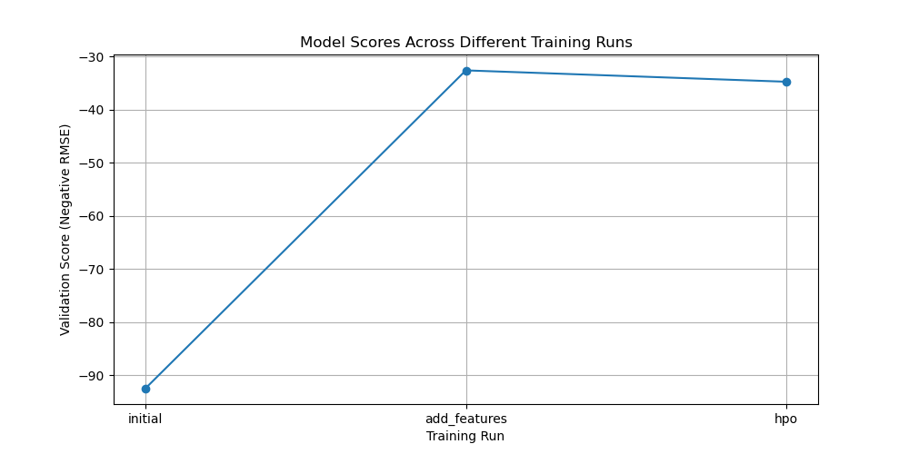

# Report: Predict Bike Sharing Demand with AutoGluon Solution
#### Roy Kensmil

## Initial Training
### What did you realize when you tried to submit your predictions? What changes were needed to the output of the predictor to submit your results?
When I first submitted my predictions, I realized that the predictions included negative values, which are not valid for the Kaggle submission. 
To correct this, I ensured that all negative predictions were set to zero before submission.

### What was the top ranked model that performed?
The top-ranked model after the initial training was the "WeightedEnsemble_L2" model. This ensemble model combined the predictions of multiple 
individual models to achieve the best performance.

## Exploratory data analysis and feature creation
### What did the exploratory analysis find and how did you add additional features?
The exploratory analysis involved creating histograms for each feature to understand their distributions. Based on this analysis, I added new features
derived from the 'datetime' column, including 'hour', 'day', and 'month'. These new features provided more granular time-related information which 
helped in improving the model's performance.

### How much better did your model preform after adding additional features and why do you think that is?
After adding the new features, the model's performance improved significantly. The initial submission had a public score of 1.86412, while the 
submission with the new features had a public score of 0.51509. This improvement is likely because the new features provided the model with more 
relevant information about the temporal aspects of the data, which is critical for predicting bike-sharing demand.

## Hyper parameter tuning
### How much better did your model preform after trying different hyper parameters?
After performing hyperparameter tuning, the model's performance did not change in terms of the public score, which remained at 0.51509. This suggests
that the hyperparameter tuning did not lead to further improvement beyond the benefits gained from adding the new features.

### If you were given more time with this dataset, where do you think you would spend more time?
If given more time, I would explore more advanced feature engineering techniques and possibly external datasets that could provide additional context, 
such as weather conditions, holidays, and events. Additionally, I would experiment with more sophisticated hyperparameter tuning methods and ensemble 
techniques to potentially improve the model's performance further.

### Create a table with the models you ran, the hyperparameters modified, and the kaggle score.
|model|hpo1|hpo2|hpo3|score|
|--|--|--|--|--|
|initial|default|default|default|1.86412|
|add_features|default|default|default|0.51509|
|hpo|NN_TORCH, GBM, CAT, XGB, FASTAI|RF, XT, KNN|time_limit=600, presets='medium_quality_faster_train'|0.51509|

### Create a line plot showing the top model score for the three (or more) training runs during the project.

### Create a line plot showing the top kaggle score for the three (or more) prediction submissions during the project.

## Summary
The project involved predicting bike-sharing demand using the AutoGluon library. Initial training with basic features resulted in a relatively high error, but
adding time-related features significantly improved the model's performance. Further hyperparameter tuning did not result in additional improvements, 
indicating that the feature engineering was the primary driver of performance gains. Future work could involve exploring more sophisticated features and external 
data sources to enhance prediction accuracy further.
